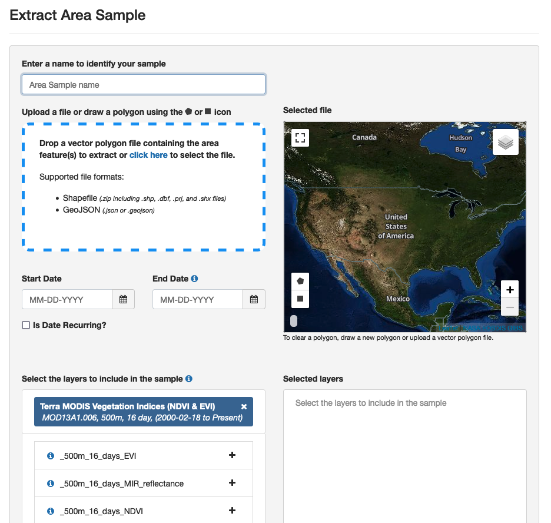
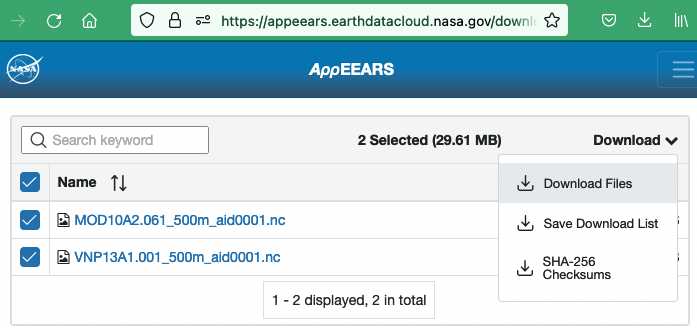

# Environmental data

(request-nasa-data)=
## Requesting environmental data from NASA

You can use a .geojson file from the [Tracks Explorer app](user_guide/tracks_explorer) to submit a request for environmental data from NASA's Application for Extracting and Exploring Analysis Ready Samples (AρρEEARS) service.
1. Go to NASA AppEEARS: <https://appeears.earthdatacloud.nasa.gov/>
2. These data are free, but you will need an EarthData account to request data. Register at <https://urs.earthdata.nasa.gov/users/new>, and then sign in with your EarthData account.
3. In the top menu bar, click "Extract > Area".
4. Click "Start new request". The interface looks like this:

5. In the Extract Area Sample page, first upload the .geojson file you created in the Tracks Explorer. Alternatively, you can draw a polygon on the page or upload another .geojson or .shp file. It will display a preview of the area for which data will be provided.
6. Select a date range. You can choose calendar dates for the start and end of the period, or select "Is Date Recurring?" to select a specific range of dates across years.
7. Select the data layers you want. Type a product name (e.g., "MYD10A2") or description (e.g., "snow") and it will display a list summarizing relevant products. To review all options, available products are listed at <https://appeears.earthdatacloud.nasa.gov/products>. Also see the searchable catalog of many of these products at <https://lpdaac.usgs.gov/product_search/?status=Operational>. Once you have selected a product(s) from the list, click the "+" button on each desired layer. The layers will appear in the "Selected Layers" box to the right.
8. In "Output options" at the bottom of the page, select "NetCDF-4" as the file format and "Geographic" as the projection.
9. Select "Submit". Your submission will be added to a queue and you will receive emails from appeears-noreply@nasa.gov confirming the submission and notifying you when the data are ready for download. The time needed to complete the request likely depends on the volume of data requested and the number of other requests their service has recently received. In our tests so far they have come through within a few hours.
10. When your data are ready for download, click the "Download" link in the email you received from appeears-noreply@nasa.gov.
11. The Appeears website will open in a new tab (log into your account if prompted) and you will see a list of files available to download. Supporting files are listed first, however you will need to download the resulting NetCDF (.nc) file for the next step in the ECODATA-Prepare app (Gridded Data Explorer).
12. Check the box to the left of the file name and select Download > Download Files at the right. The downloaded file will appear in your Downloads folder, which you can then move to a local folder. We also recommend downloading at least the README.md file under Supporting files. This will document details of your request and results that you may need to return to later, including data quality information and how to cite your results.

(request-ecmwf-data)=
## Requesting environmental data from ECMWF

[ECMWF ERA5 hourly data]( https://cds.climate.copernicus.eu/cdsapp#!/dataset/reanalysis-era5-single-levels) can be requested [here](https://cds.climate.copernicus.eu/cdsapp#!/dataset/reanalysis-era5-single-levels?tab=form). Note that you will need to make an account to request data.

To request data:
1. Go to the [data request page](https://cds.climate.copernicus.eu/cdsapp#!/dataset/reanalysis-era5-single-levels?tab=form).
2. In the "Variable" section, select the variables you wish to download.
3. Select the times of interest.
4. Under "Geographical area", select "Sub-region extraction" and enter the bounding box coordinates for the area of interest (max and min longitude and latitude)
5. Under "Format", select "NetCDF (experimental)"