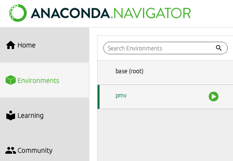

# Installing the apps

(installers)=
## Installers

Download installers for the latest release:
| OS             | Architecture          | Download                                                                                                                        |
|----------------|-----------------------|---------------------------------------------------------------------------------------------------------------------------------|
| Windows        | x86_64                | XXXXX |
| macOS 14       | arm64 (Apple Silicon) | XXXXX |
| `(*)` macOS 13 | x86_64                | XXXXX |
| Linux          | x86_64                | XXXXX |

`(*)` Use this installer for all Macs that are **not** an Apple Silicon (M-series) Mac running macOS 14 (i.e., use for all x86 (Intel chip) Macs, or any Mac running macOS 13).

Relase notes for the latest release can be found XXXXX

1. Download the correct installer for your operating system.
2. Run the installer and follow the prompts. You can change the default installation location if you wish. This installation location is where the program files will be installed (i.e., files not intended to be accessed by the user after installation). If you have a previous version already installed in the default location, you will need to remove the previous version before installing the new version, or install the new version in a different location.
If opening the .pkg in Mac, you might get a message that it "cannot be opened because it is from an unidentified developer". If this happens, you can right-click or press ``Control`` click on the application, and then select Open. You can then select Open to run the installer.
3. A file used to launch the apps (``ecodata.command`` for Mac and ``ecodata.bat`` for Windows) will be copied to your Downloads folder. You can move this file to a convenient location after the installer is finished running. **Note**: If you already have an ``ecodata.command`` or ``ecodata.bat`` file in your Downloads folder from a previous installation, remove it before installing the new version.

After the installation is complete, you can [get started](./user_guide/index).

(alternative-installation)=
## Alternative installation methods

The apps can also be installed from the command line. If you have issues with the first installation method (e.g. your
computer's security settings are preventing the installer from running), you can use this method as a backup.

### Install using conda (recommended)
ECODATA is available on conda-forge and can be installed directly using conda. This method requires installing conda.

#### Install ECODATA using conda
1. Download and install Miniconda. [See instructions for installing Miniconda and download installers here](https://docs.anaconda.com/free/miniconda/index.html). If you already have conda installed, you can skip this step.
2. Open a terminal.

    **Mac/Linux**: Run the commands from the built-in "Terminal" application, or any other terminal app.

    **Windows**: Run the commands from the Anaconda Powershell Prompt (this was installed by Miniconda). You can find this by
    searching for "Anaconda Powershell Prompt" in the Start menu.

    You can check that your Conda installation was successful by running `conda list`. If Conda has been installed correctly, a list of installed packages will appear.

3. Install ECODATA in a new conda environment:

    ```bash
    conda create -n eco ecodata -c conda-forge
    ```

    This will install ECODATA in a new conda environment named "eco". This includes downloading all of the packages for the application, so it may take some time to finish, depending on your internet speed. Once the environment is successfully created, the terminal output should look something like:

    ```bash
    #
    # To activate this environment, use
    #
    #   $ conda activate eco
    #
    # To deactivate an active environment, use
    #
    #   $ conda deactivate
    ```

    If you get the message "An unexpected error has occured", try running the command again. Your internet connection
    might have dropped briefly and caused the downloads to fail.

    ```{important}
    **For Windows**: Don't click anywhere in the command prompt while commands are running! The Windows command prompt
    has a "feature" called QuickEdit Mode that is enabled by default and causes programs to pause when clicking inside
    the command window. It will not give any indication that a program is paused, so you might think the program is
    stuck when it has been paused accidentally.
    ```

#### Launching ECODATA from the command line

Launch the ECODATA-Prepare apps using the command below. For **Mac/Linux**, you will run the command below from the built-in Mac “Terminal” application, or any other terminal app. For **Windows**, you will run the command using the Anaconda Powershell Prompt. If this is not already open, find it by searching for "Anaconda Powershell" in the start menu.

First, you need to activate the conda environment where ECODATA is installed:

```bash
conda activate eco
```

Next, launch the apps:
```bash
python -m ecodata.app
```

A window will open on your default web browser, showing the main app gallery page (the apps are running locally at ``localhost:5006``). There may be a short wait the first time you launch the apps, or the first time you launch after an update.

You may receive a message "Do you want the application "python3.11" to accept incoming network connections?" You can click Allow.

Keep the terminal application you used to launch the program open while running the app. To shut down the apps, close the terminal that you used for launching.

After the installation is complete, you can [get started](./user_guide/index).

## Updating ECODATA-Prepare from the terminal

You can check which version of ecodata you have installed by running:

```bash
conda activate eco
conda list ecodata
```

You can see new releases on the releases page

If you want to install a new release, you can update your version of the apps by running the command below:

```bash
conda activate eco
conda update ecodata
```

After the installation is complete, you can [get started](./user_guide/index).

### Install using Anaconda (legacy method, not recommended)

See below for steps to install and run the ECODATA-Prepare apps. For **Mac/Linux**, you will run the commands below from the built-in Mac "Terminal" application, or any other terminal app. For **Windows**, you will install Anaconda and then run the commands below using the Anaconda Powershell Prompt. You can launch this by searching for "Anaconda Powershell" in the start menu, or by launching Anaconda Navigator and looking for "Powershell Prompt" in the home screen.

```{note}
The apps are still under development, and installation will be simplified soon!
```

#### Installing Anaconda

1. Anaconda Distribution is an free, open-source distribution platform for managing and deploying Python and R packages. Install Anaconda if you do not have it on your computer. [Download the installer here](https://www.anaconda.com/products/distribution) and then run the file to install the program.

2. **For Windows only:** To address compatibility issues, downgrade conda to the previous version (v4.14). In the Anaconda Powershell prompt, run:

    ```bash
    conda install conda=4.14
    ```

#### Preparing the Python environment and installing ECODATA-Prepare

3. [Download the conda environment file here](../../environment-clean-build.yml). This file specifies the Python package requirements used by the apps, and can be deleted following installation.

4. Open a terminal (for Windows, use Anaconda Powershell).

5. Navigate to the directory where you saved the environment file. Run ``cd <path_to_directory>`` (note that you need to replace the path with the actual path to the directory where you saved the file), for example:

    ```bash
    cd Downloads
    ```

6. You can confirm you navigated to the correct directory by running "ls" to list the files in that directory:

    ```bash
    ls
    ```
    You should see the environment file in the output, for example:

    ```bash
        Directory: XXXXX


    Mode                LastWriteTime       Length Name
    ----                -------------       ------ ----
    -a----      11/30/2022  12:38 PM        23470 environment-clean-build.yml
    ```

If your directory has many files, replace "ls" with "ls -lt" to sort files by the time they were last modified.

7. Install the environment (note that if your environment file is not called "environment-clean-build.yml", you need to replace this name with the actual name of your file):

    ```bash
    conda env create --file environment-clean-build.yml --name eco
    ```

    This will download all of the packages for the application, so it may take some time to finish, depending on your internet speed. Once the environment is successfully created, the terminal output should look something like:

    ```bash
    done
    #
    # To activate this environment, use
    #
    #   $ conda activate eco
    #
    # To deactivate an active environment, use
    #
    #   $ conda deactivate
    ```

    If there were issues with the installation, you can try using the locked environment file for your operating system instead: [Windows](../../environment-win-lock.yml) | [Intel Mac](../../environment-x86-lock.yml) | [M1 Mac](../../environment-m1-lock.yml)


8. After the Python environment is completed, you need to install the ECODATA-Prepare application itself. From the terminal, run:

    ```bash
    conda activate eco
    pip install XXXXXt@main
    ```

After the installation is complete, you can get started

#### Launch using Anaconda

If you have installed Anadonda (Anaconda PowerShell for Windows, Anaconda Navigator for Mac), you can also launch ECODATA-Prepare through this program.

To launch in Windows,

- Open Anaconda PowerShell.
- Copy-paste the below code into the prompt window, and press Enter:

```bash
conda activate eco
python -m ecodata.app
```

To launch on Mac,

- Open Anaconda Navigator.
- Select Environments from the upper left and navigate to "ecodata".



- Hit the play button and select "Open Terminal".
- A Terminal window will open. Enter the following and hit Return:

```bash
python -m ecodata.app
```
