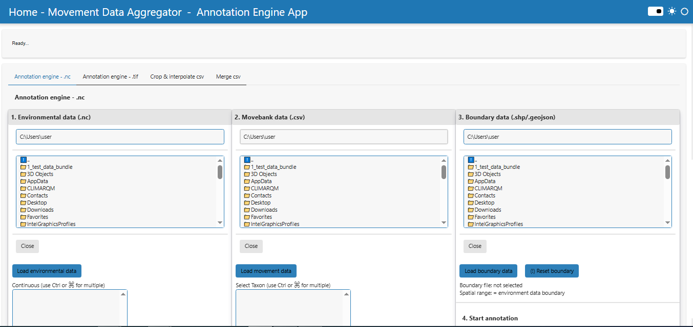
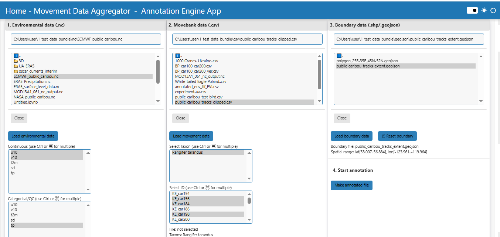
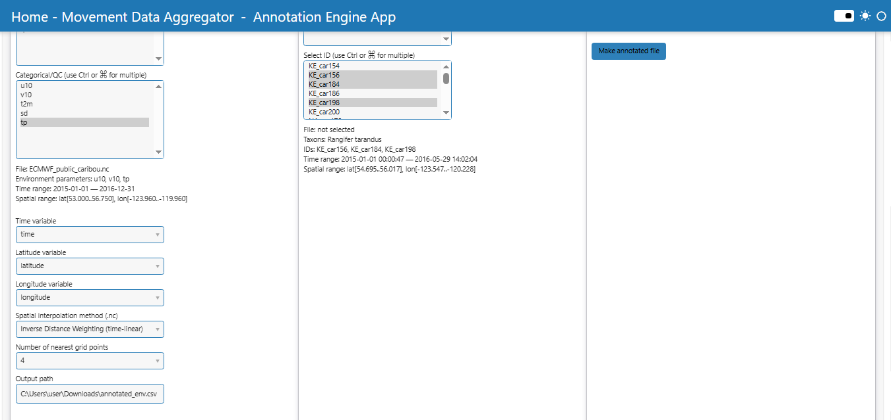
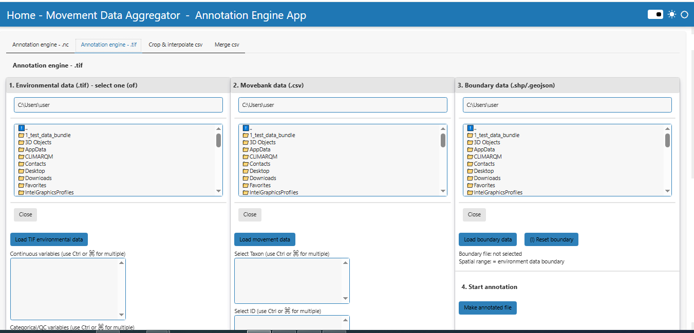
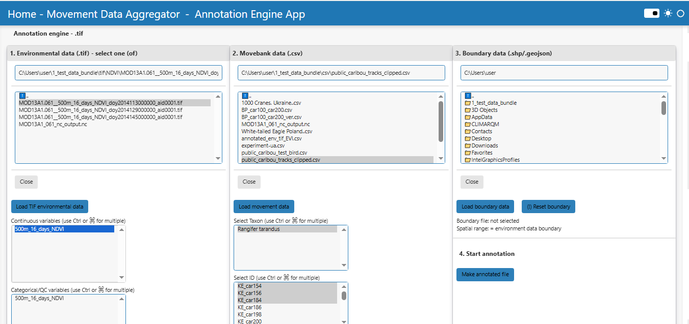
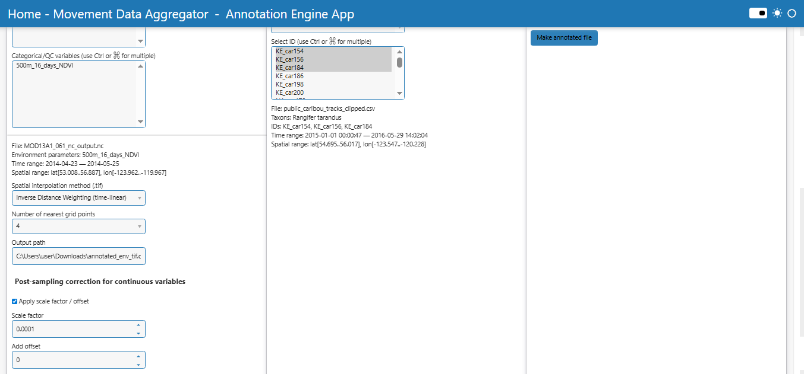
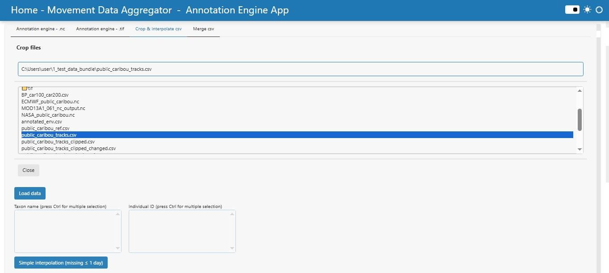
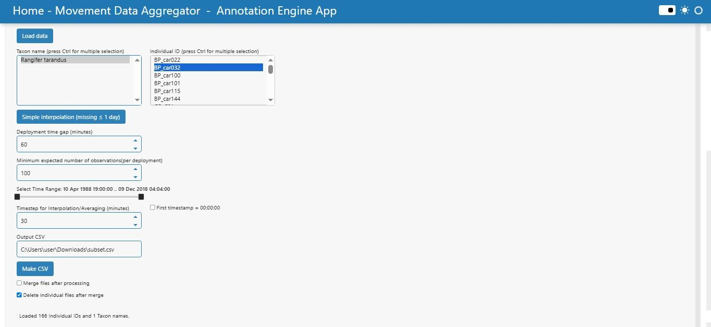
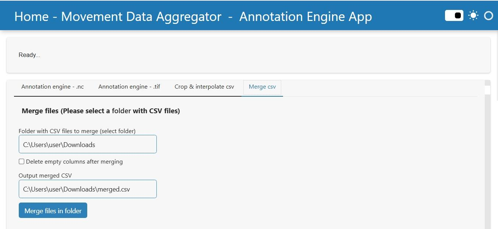

# Annotation Engine

## Overview

### App features

With the Annotation Engine App, you can

- Annotate movement data with environmental variables from gridded environmental datasets.
- Load movement data and environmental data from supported formats such as NetCDF and GeoTIFF.
- Select environmental variables for annotation.
- Match movement records with environmental values by location and time.
- Use different annotation approaches for continuous variables and categorical or quality-control variables.
- Apply spatial and temporal matching or interpolation methods where supported.
- Optionally apply scale factor and offset corrections to continuous variables.
- Export annotated movement data for further analysis or visualization.

### Using the app

1. If you haven't already, prepare a local movement data file and the environmental datasets you want to use for annotation.
2. Launch the Annotation Engine App.
3. Select the movement data file. The file should contain location and time information compatible with the ECODATA movement data format.
4. Load the environmental dataset or datasets. Depending on the workflow, these may be NetCDF or GeoTIFF files.
5. Select the environmental variables that should be added to the movement records.
6. Specify whether selected variables should be treated as continuous variables or categorical / quality-control variables.
7. Select the annotation method and, if available, the spatial or temporal interpolation options.
8. If using continuous variables with scale factor or offset values, set these options before running the annotation.
9. Run the annotation process.
10. Review the status messages and save the annotated movement data file.

## Annotation Engine App Manual

The Annotation Engine App contains four working tabs: Annotation engine - .nc, Annotation engine - .tif, Crop & interpolate csv, and Merge csv. The first two tabs annotate Movebank-style movement data with environmental variables. Crop & interpolate csv prepares movement CSV files before annotation. Merge csv merges CSV outputs into one file.

## Tab #1: Annotation engine - .nc

### Purpose

The Annotation engine - .nc tab annotates animal movement tracks from a Movebank-style CSV file using environmental variables from one NetCDF (.nc) file. Each movement point is matched by timestamp, latitude, and longitude to selected environmental variables.

The current version supports separate handling of continuous variables and categorical/QC variables. Continuous variables can be interpolated, while categorical flags, quality-control layers, land-cover classes, and similar data remains as raw codes.

- Spatial filtering by an optional vector boundary (.shp or .geojson).
- Automatic boundary from the NetCDF extent if no vector boundary is selected.
- Manual selection of the Time, Latitude, and Longitude coordinate variables from the NetCDF file.
- Support for 3D variables with dimensions such as time/lat/lon and for common vertical level dimensions. If a variable contains pressure/vertical levels, the app exposes labels such as `variable_1000`, `variable_975`, etc.
- Saving one main annotated CSV and separate per-individual CSV files.

### Overview

#### Step 1. Load environmental data (.nc)

- Select one NetCDF file in the Environmental data (.nc) selector.
- Press Load environmental data.
- The app reads the file name, time range, spatial range, available variables, and candidate coordinate variables.
- Check the Time variable, Latitude variable, and Longitude variable selectors. Adjust them manually if the automatic choice is not correct.
- Choose environmental variables in the Continuous selector and/or in the Categorical/QC selector. The same variable cannot be used as both continuous and categorical/QC.

#### Step 2. Load movement data (.csv)

- Select a Movebank-style CSV file in the Movebank data (.csv) selector.
- Press Load movement data.
- The app extracts taxon names, individual IDs, the movement time range, and the movement spatial range.
- Optionally filter by Select Taxon, then select one or more IDs in Select ID.

#### Step 2a. Configure annotation options

| Option | Meaning in the current app |
| --- | --- |
| Continuous variables | Numeric environmental variables that may be spatially interpolated and linearly interpolated in time. |
| Categorical/QC variables | Class, flag, mask, quality control, land cover or similar variables that are sampled by nearest spatial grid cell and nearest available timestep. |
| Time / Latitude / Longitude variable | NetCDF coordinate mapping used to standardize the dataset before annotation (some files might use names such as `valid_time`, `y`, `x`, `latitude`, or `longitude`). |
| Interpolation method (spatial) | Nearest neighbor or Inverse Distance Weighting (IDW). The selected method applies to continuous variables. Categorical/QC variables always use nearest-neighbor logic. |
| Number of nearest grid points | Used for IDW. Available values are 2, 4, 6, and 8. For Nearest neighbor, the value is forced to 1 internally. |
| Output path | Path to the main annotated CSV. The default is in the user Downloads folder. |

#### Interpolation behavior

| Variable type | Nearest neighbor selected | IDW selected |
| --- | --- | --- |
| Continuous | Nearest spatial grid cell + linear interpolation in time. | k nearest spatial grid cells + linear interpolation in time for each grid cell + IDW spatial weighting. |
| Categorical/QC | Nearest spatial grid cell + nearest available timestep. | Still uses nearest spatial grid cell + nearest available timestep. It is not IDW-averaged and not linearly interpolated in time. |

#### Step 3. Load boundary data (optional)

- Select a .shp or .geojson boundary in the Boundary data (.shp/.geojson) selector.
- Press Load boundary data.
- The app displays the boundary file name and spatial range.
- If no boundary is selected, the NetCDF spatial extent is used automatically during annotation.
- Use (!) Reset boundary to return to the automatic NetCDF boundary.

#### Step 4. Run annotation

- Press Make annotated file in the 4. Start annotation block.
- The app filters movement records by selected ID(s).
- The app applies the selected boundary. If no boundary is loaded, it uses the NetCDF extent.
- The app prefilters movement points to the union time window of the selected NetCDF variables.
- The app annotates each point with the selected continuous and categorical/QC variables using the rules described above.
- The app saves the main CSV to Output path and creates an `annotated_individuals` folder next to it.

### Output scenarios

- Boundary not loaded: automatic boundary from the NetCDF extent is used.
- Boundary loaded: only movement points inside the polygon are kept.
- Continuous + Nearest neighbour.
- Continuous + IDW.
- Categorical/QC variables: nearest spatial cell and nearest timestep, regardless of the selected interpolation method for continuous variables.
- Movement points outside the NetCDF spatial or temporal coverage are removed by filtering.

### Expected results

- Main annotated CSV saved to the selected Output path.
- A subfolder named `annotated_individuals` containing one annotated CSV per individual ID, if the individual ID column is available.

## Tab #2: Annotation engine - .tif

### Purpose

The Annotation engine - .tif tab annotates movement tracks using environmental data distributed as AppEEARS-style GeoTIFF files. The user selects one sample .tif file from the target folder, and the app processes all .tif files in that same folder.

The app converts the TIF stack into one temporary NetCDF file before annotation. In the current version, this temporary NetCDF is saved in the same folder as the input TIF files. Movebank data is not required for the TIF-to-NetCDF loading/conversion step, but it is required when the annotation is actually run.

- All .tif files in the selected folder are collected and converted to one NetCDF file.
- Only variables with at least three dimensions, typically time/lat/lon, are made available for annotation.
- Variables are split into Continuous variables and Categorical/QC variables.
- The app makes an initial guess of variable type from variable names, but the user should check and adjust this split manually.
- Optional post-sampling scale factor and add offset can be applied to continuous variables only.

### Overview

#### Step 1. Load TIF environmental data

- Select any single .tif file inside the folder that contains the full TIF time series.
- Press Load TIF environmental data.
- The app collects all .tif files in the same folder.
- The app converts the TIF stack to one NetCDF file in the TIF folder.
- The app displays the generated NetCDF file name, time range, spatial range, and detected variables.
- Review the Continuous variables and Categorical/QC variables lists and correct them if necessary.

Note: The TIF-to-NetCDF conversion keeps raw raster values. Scale factor and offset are not applied during conversion. Optional correction is applied later, after sampling, and only to continuous variables.

#### Step 2. Load movement data (.csv)

- Select a movement data CSV file with Movebank-compatible column names.
- Press Load movement data.
- The app extracts taxon names, individual IDs, time range, and spatial range.
- Select the required taxon(s) and individual ID(s). At least one individual ID must be selected before running TIF annotation.

#### Step 2a. Configure interpolation and value correction

| Option | Meaning in the current app |
| --- | --- |
| Continuous variables | Variables that can be spatially interpolated and linearly interpolated in time. Optional scale/offset correction can be applied to these variables after sampling. |
| Categorical/QC variables | Variables that should remain raw category, flag, or QC codes. They are sampled by nearest grid cell and nearest timestep only. |
| Interpolation method (spatial) | Nearest neighbour or IDW for continuous variables. Categorical/QC variables are not IDW-averaged. |
| Number of nearest grid points | Controls the number of grid cells used for IDW for continuous variables. |
| Apply scale factor / offset | Enables post-sampling correction for continuous variables only. |
| Scale factor | Multiplier in `corrected_value = sampled_value * scale_factor`. |
| Add offset | Additive offset in `corrected_value = sampled_value * scale_factor + add_offset`. |
| Output path | Path to the main annotated CSV. The default is in the user Downloads folder. |

#### Step 3. Load boundary data (optional)

- Select a .shp or .geojson boundary file if spatial filtering by polygon is required.
- Press Load boundary data.
- If no boundary is selected, the extent of the generated NetCDF is used automatically.
- Use (!) Reset boundary to return to the automatic NetCDF boundary.

#### Step 4. Run annotation

- Press Make annotated file in the 4. Start annotation block.
- The app verifies that Movebank data, a sample TIF file, selected ID(s), and selected environmental variables are available.
- The app reconverts or confirms the TIF stack as a NetCDF file in the TIF folder.
- The app builds the environmental variable map from valid time/lat/lon variables.
- The app applies the selected boundary or the automatic NetCDF extent.
- Continuous variables are annotated using the selected spatial interpolation method and linear temporal interpolation.
- Categorical/QC variables are annotated using nearest spatial grid cell and nearest available timestep.
- If enabled, scale factor and add offset are applied after sampling to continuous variables only.
- The main annotated CSV and per-individual CSV files are saved.

### Output scenarios

- Boundary not loaded: automatic boundary from the generated NetCDF extent is used.
- Boundary loaded: only movement points inside the polygon are used.
- Continuous + Nearest neighbour.
- Continuous + IDW.
- Categorical/QC variables: never IDW-averaged, never time-linearly interpolated, and never scaled/offset.
- Scale/offset disabled: raw sampled values are saved.
- Scale/offset enabled: corrected continuous values are saved using `corrected_value = sampled_value * scale_factor + add_offset`.

### Expected results

- Main annotated CSV saved to Output path.
- A subfolder named `annotated_individuals` containing one annotated CSV per individual ID.
- A generated temporary NetCDF file stored in the same folder as the source TIF files.

## Tab #3: Crop & Interpolate CSV

### Purpose

The Crop & Interpolate CSV tab is designed to pre-process Movebank CSV datasets by:

- Subsetting by taxon or individual IDs.
- Cropping to a specific time range.
- Interpolating missing values with a regular time grid.
- Optionally averaging numeric variables over fixed intervals.
- Splitting sessions based on deployment gaps.
- Producing per-individual and merged CSV outputs.

### Overview

#### Step 1. Load Input Data

1. Local CSV file

   - Select a Movebank-style CSV file.
   - Press Load data.
   - Taxons and IDs are extracted.
   - Time coverage is shown in the slider.

2. Select Taxons and IDs

   - Use Taxon name to filter IDs.
   - Choose one or more Individual IDs.

#### Step 2. Configure Options

Simple interpolation (missing <= 1 day)

- Fills only short gaps (up to 1 day).
- Creates CSVs with interpolated values only for eligible gaps.

Advanced interpolation ("Make CSV" button)

1. Deployment time gap (minutes)

   - Splits sessions if there is a gap larger than this threshold.
   - Prevents mixing different tracking deployments.

2. Minimum expected observations

   - Skips sessions with too few points (e.g., <100).

3. Time range

   - Set with the slider.
   - Crops data to the chosen period.

4. Interpolation/Averaging parameters

   - Timestep (minutes):
     - If =1: interpolation only.
     - If >1: averaging over intervals.
   - First timestamp = 00:00:00:
     - Optionally truncate sessions to start at midnight.

5. Output CSV name

   - Base name for generated files.
   - Example: `subset.csv` creates `subset_<ID>.csv`.

6. Merge & cleanup options

   - Merge files after processing: combine all per-ID files.
   - Delete individual files after merge: keep only the merged dataset.

#### Step 3. Run Processing

Press Make CSV. The app:

1. Filters data by ID and time.
2. Splits into sessions using `deployment_time_gap`.
3. Performs 1-minute interpolation (always).
4. Performs optional averaging at user timestep.
5. Writes per-session CSVs (`__<start>_to_<end>.csv`).
6. Creates per-ID CSVs.
7. Optionally merges files into a single dataset.

### Output scenarios

- Simple interpolation only: per-ID CSVs with gaps <= 1 day filled.
- Make CSV with timestep = 1: per-ID datasets interpolated to 1-min intervals.
- Make CSV with timestep > 1: per-ID datasets averaged (e.g., 30 min).
- Merge enabled: single combined CSV created.
- Delete after merge enabled: keeps only merged file.

### Expected results

You will obtain:

1. Per-ID CSVs (subsetted and interpolated).
2. Session-specific files (`__start_to_end.csv`).
3. Optional merged dataset.
4. Optional interpolated files (`__interp_inplace_le1d.csv`) when using Simple interpolation.

## Tab #4: Merge CSV

### Purpose

The Merge CSV tab is designed to combine multiple CSV files (from previous processing or annotation) into a single dataset.

It ensures consistency of column names, optionally removes non-overlapping columns, and provides one merged file for further analysis.

### Overview

#### Step 1. Select Folder

- Enter or browse to a folder containing multiple .csv files.
- All files in the folder will be processed.

#### Step 2. Configure Options

- Delete empty columns after merging
  - If enabled: columns missing in at least one file are dropped.
  - If disabled: all columns are preserved; missing values filled with NaN.
- Output merged CSV name
  - Path and filename for the merged file (default: `merged.csv`).

#### Step 3. Run Merge

Press Merge files in folder. The app:

- Collects all .csv files from the folder.
- Normalizes column names.
- Concatenates data into one DataFrame.
- Drops non-shared columns if the option is enabled.
- Saves the merged file to the defined path.

### Output scenarios

- Delete empty columns enabled
  - Cleaner file with only shared columns.
  - Some information may be lost.
- Delete empty columns disabled
  - All columns preserved.
  - Resulting CSV may contain NaN values in places where a column was missing in some files.

### Expected results

After successful processing, you will obtain:

1. One merged CSV saved at the chosen path.
2. A message in the app showing the path of the merged file and the list of columns that were removed, if any.
