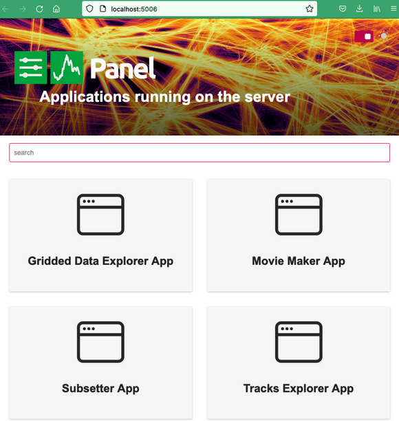

# Getting started

## Overview

ECODATA-Prepare is a set of four Python-based apps to read, process, and create animations from animal tracking data and gridded environmental data. [Read here](../index) for an overview and to learn how to install, contribute and get support. Before using this program, gather files you want to use with the app. This could include:
* a .csv file of tracking data, in Movebank’s .csv format
* NetCDF files of environmental data (you can [order these](../environmental_data) from NASA or ECMWF)
* shapefiles
* a folder of sequentially-numbered .png files that are frames for an animation (you can create these with ECODATA-Animate

If needed, see the [installation instructions](../installation) to install or update the program.

See [below](#opening-ecodata-prepare) for instructions to open the program. When it opens, it will display the main panel, showing the four apps. Click on an app to launch it. From there, you can navigate between apps within the interface, or switch between them by pasting these URLs in your browser window:

* Main app gallery: <http://localhost:5006>
* Tracks Explorer App: <http://localhost:5006/tracks_explorer_app>
* Gridded Data Explorer App: <http://localhost:5006/gridded_data_explorer_app>
* Subsetter App: <http://localhost:5006/subsetter_app>
* Movie Maker App: <http://localhost:5006/movie_maker_app>



## Opening ECODATA-Prepare

```{Note}
These instructions assume that you installed ECODATA using the [Installers](installers). If you installed ECODATA using one of the [alternative methods](alternative-installation), you will need to launch the apps using the instructions there.
```

Double-click on the launch file (``ecodata.command`` for Mac, ``ecodata.bat`` for Windows). A terminal window will open,
indicating that the apps are launching. When the apps finish launching, a window will open on your default web browser,
showing the app gallery. The apps are running locally at `localhost:5006`. *Note: There may be a short wait (10+ seconds)
before the browser window opens, particularly if you are launching the apps for the first time.*

You may receive a message "Do you want the application "python3.11" to accept incoming network connections?" You can click Allow.

Keep the terminal window open while running the app. To shut down the apps, close the terminal that opened when the apps launched.
