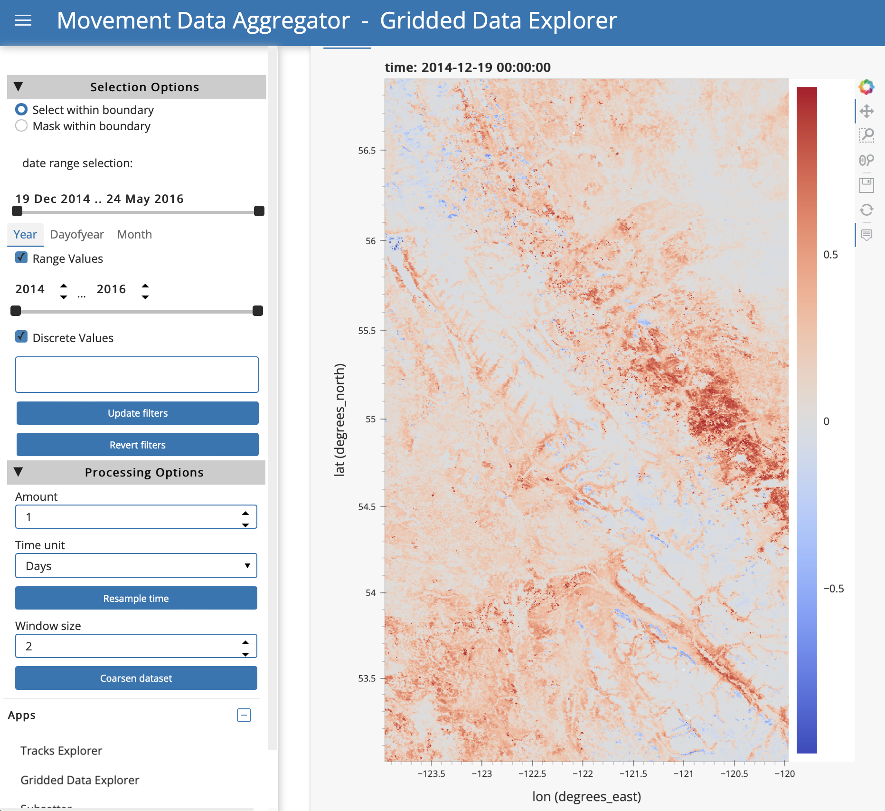
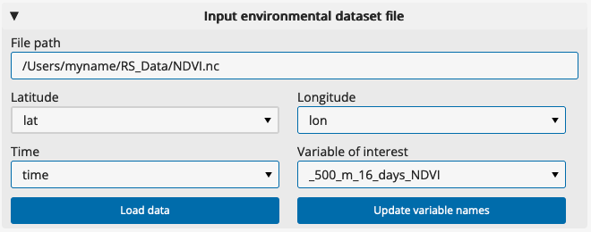
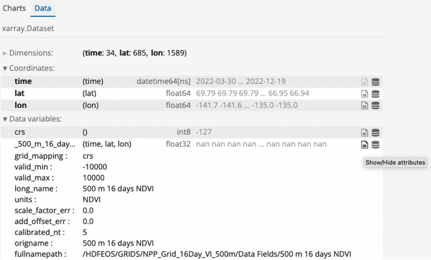
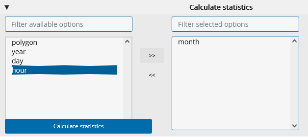
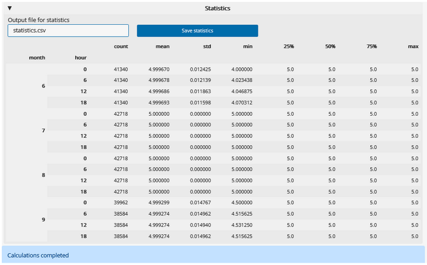

# Gridded Data Explorer

## App features

With the Gridded Data Explorer App, you can
- Read, interpolate and subset the temporal and spatial resolutions of environmental data in the form of a temporal stack (or single static map) NETCDF file.
- Read GIS polygons and mask the environmental data outside or inside of the polygons.
- Calculate data summaries by time period and spatial area.
- Save processed environmental data and summary statistics for further use. 

## Using the app

Throughout the App, scroll down to view status messages indicating application progress and next steps.  
1. Under "Input environmental dataset", paste the full filepath to a netcdf (.nc) file received from NASA AppEEARS ([see instructions](request-nasa-data)) or any other source. The filepath should include the file name. An example filepath is "/Users/myname/RS_Data/NDVI.nc".
2. Click "Load data". If it is able to read the file, the app will load available variables from the file into dropdown lists for Latitude, Longitude, Time and Variable of interest, and will attempt to select the correct variables automatically. If nothing happens, you might need to correct the filepath.
3. If the app does not assign the correct variable names from the file, you can specify them manually by clicking on the field and selecting from the dropdown list.
4. In the "Variable of interest" dropdown, select the variable you would like to explore.

5. Once the input parameters are set, click "Update variable names". Plots of the data will appear.
6. At the top of the area with the plots, there are two tabs ("Charts" and "Data"). If you click the "Data" tab, you can see more information about the file contents, including the dimensions of the dataset and the variables in the file. Click on the "Show/Hide attributes" icon to the right of a variable to view variable metadata including long names, units, and legend classes.

7. In the "Charts" tab, there are a variety of options to explore the selected variable in space and time.
8. **Filter by area:** Under "Input polygon file", you can input a polygon file to select or mask data inside polygon boundaries. Selecting will keep data *inside* polygons, and masking will keep data *outside* polygons. Paste the full filepath to a polygon file (e.g., .shp), including the file name, and click "Load file". When the file loads, it will be plotted on the Chart view above. Select and option and then click "Update filters". To remove the filter, click "Revert filters".
9. **Filter by time:** To filter the data for specific times, use the options under "date range selection" under Selection Options on the sidebar. There are time filtering options in the sidebar if you want to filter the data for a specific time range or time conditions (e.g., daytime only, specific seasons or months). You can use the time slider bars to filter by a range of values or enter discrete values into the box. For example, to filter by month you would click the "Month" tab above the "Range Values" option and either use the sliding bar to restrict your data to months of interest or enter numeric months into the Discrete Values box (note that when you click in this box, a dropdown appears with the month values from your Appeears dataset). Available ranges and categories for discrete filtering will depend on the content of your dataset. Select your options and then click "Update filters". If you want to remove the filters you have applied, click "Revert filters".
10. **Resample by time:** It is possible to resample the data by time. The app will estimate attribute values from the original values at the requested time schedule by interpolating when upscaling, or using means for downsampling. Upscaling could be used to show smooth transitions in an animation with daily timestamps of a product with a 16-day resolution; downscaling could be used to reduce storage and processing needs for a large hourly dataset if you need only daily data. Under "Processing Options" in the sidebar, select the desired time frequency and click "Resample time". Once processing is complete,  the status at the bottom of the page will show "Dataset Resampled". 
11. **Coarsen spatial resolution:** It is possible to coarsen (downsample) the spatial resolution of the data using block aggregation, for example to reduce file sizes or processing time for subsequent uses. Under "Processing options" in the sidebar, select a window size for coarsening and click "Coarsen dataset". The window size will indicate the number of pixels in the x and y directions over which a mean should be calculated. Once processing is complete, the status at the bottom of the page will show "Aggregation completed".
12. After applying filters or processing to the data, you can save the results as a new .nc file. Under "Output file", choose a name for the file. You can specify a filepath, or provide only a file name to have it saved in a default folder on your computer. Select "Save dataset". Below, a message "File saved to: \[filepath]" will indicate where the file is stored.
13. **Calculate summary statistics:** First select grouping options in the "Calculate statistics" panel, then click "Calculate statistics". 

Once processing is complete, the status at the bottom of the page will show "Calculations completed", and a table of the summary statistics will appear in the "Statistics" panel. You can save this output as a new .csv file. Under "Output file for statistics", choose a name for the file. You can specify a filepath, or provide only a file name to have it saved in a default folder on your computer. Select "Save statistics". The status message will update to indicate where the file is stored.

