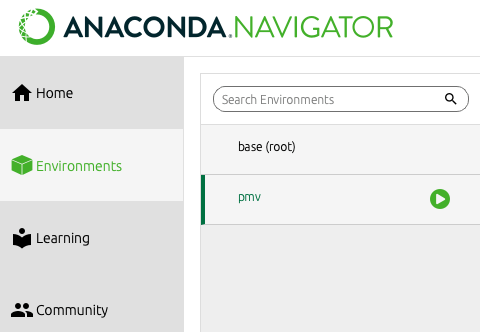

# User guide

ECODATA-Prepare is a set of four Python-based apps to read, process, and create animations from animal tracking data and gridded environmental data. [Read here](../index) for an overview and to learn how to install, contribute and get support.

Want a downloadable version of the docs? This documentation is also [available for download](https://readthedocs.org/projects/ecodata-apps/downloads/) as a PDF, Epub, or zipped HTML.

## Getting started

Before using this program, download a local copy of the tracking data you want to use, in Movebank’s .csv format. It is possible to subset or combine data from different studies. Read the [installation instructions](../installation) to install or update the program.

Follow the instructions below to launch the program. A window will open on your default web browser, showing the app gallery. The apps are running locally at localhost:5006. *Note: Anaconda gives no indication the command is running. There may be a short wait (10+ seconds) before the window opens.*

When it opens, it will display the main panel, showing the four apps. Click on an app to launch it. From there, you can navigate between apps within the interface, or switch between them by pasting these URLs in your browser window:

* Main app gallery: <http://localhost:5006>
* Tracks Explorer App: <http://localhost:5006/tracks_explorer_app>
* Gridded Data Explorer App: <http://localhost:5006/gridded_data_explorer_app>
* Subsetter App: <http://localhost:5006/subsetter_app>
* Movie Maker App: <http://localhost:5006/movie_maker_app>

### Launch in Windows

- Open Anaconda PowerShell.
- Copy-paste the below code into the prompt window, and press Enter:

```bash
conda activate eco
python -m ecodata.app
```

### Launch on Mac

- Open Anaconda Navigator.
- Navigate to "eco".



- Hit the play button and select "Open Terminal".
- A Terminal window will open. Enter the following and hit Return:

```bash
python -m ecodata.app
```


## Apps
```{toctree}
---
maxdepth: 2
---
tracks_explorer
gridded_data_explorer
subsetter
movie_maker

```