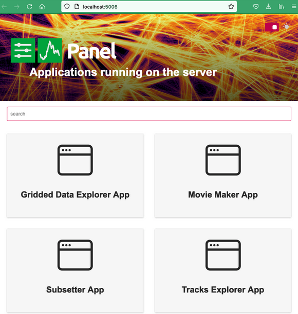

# User guide

ECODATA-Prepare is a set of four Python-based apps to read, process, and create animations from animal tracking data and gridded environmental data. [Read here](../index) for an overview and to learn how to install, contribute and get support.

```{tip}
Want a downloadable version of the docs? This documentation is also [available for download](https://readthedocs.org/projects/ecodata-apps/downloads/) as a PDF, Epub, or zipped HTML.
```

## Getting started

Before using this program, download a local copy of the tracking data you want to use, in Movebank’s .csv format. It is possible to subset or combine data from different studies. Read the [installation instructions](../installation) to install or update the program.

To launch the apps, double-click on the launch file (`ecodata.command` for Mac,
`ecodata.bat` for Windows). A terminal window will open, indicating that the apps are launching. When the apps finish launching, a window will open on your default web browser, showing the app gallery. The apps are running locally at localhost:5006. _Note: There may be a short wait (10+ seconds) before the browser window opens._

When it opens, it will display the main panel, showing the four apps. Click on an app to launch it. From there, you can navigate between apps within the interface, or switch between them by pasting these URLs in your browser window:

- Main app gallery: <http://localhost:5006>
- Tracks Explorer App: <http://localhost:5006/tracks_explorer_app>
- Gridded Data Explorer App: <http://localhost:5006/gridded_data_explorer_app>
- Subsetter App: <http://localhost:5006/subsetter_app>
- Movie Maker App: <http://localhost:5006/movie_maker_app>
<!-- added this line new -->
- Time Extractor App: <http://localhost:5006/time_extractor_app>

<!-- Added this to display timeExtractor -->
* Time Extractor App: <http://localhost:5006/time_extractor_app>



## Apps

```{toctree}
---
maxdepth: 2
---
tracks_explorer
gridded_data_explorer
subsetter
movie_maker

```
