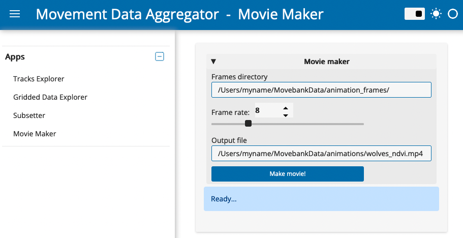

# Movie Maker

## App features

With the Movie Maker App, you can 
- Create an animation file out of a stack of static maps that become frames in the animation. 
- Animations can include tracking data along with other layers, including [environmental data from NASA Appeears](https://ecodata-apps.readthedocs.io/en/latest/user_guide/tracks_explorer.html#requesting-environmental-data-from-nasa), elevation contours, and other features. Frames using these layers can be created with [ECODATA-Animate](https://www.movebank.org/cms/movebank-content/ecodata#ecodata-animate).

## Using the app

1. Paste the full path to a folder of images to use as frames of the animation. You can create these frames using [ECODATA-Animate](https://www.movebank.org/cms/movebank-content/ecodata#ecodata-animate). Make sure there are no other files in the folder.
2. Select the frame rate for the video, in frames per second.
3. Optionally, change the filename and filepath defining where to save the output.
4. Click "Make movie". The movie will be saved as a .mp4 file in the selected folder. Be sure not to change the folder location or name while the app is processing.
