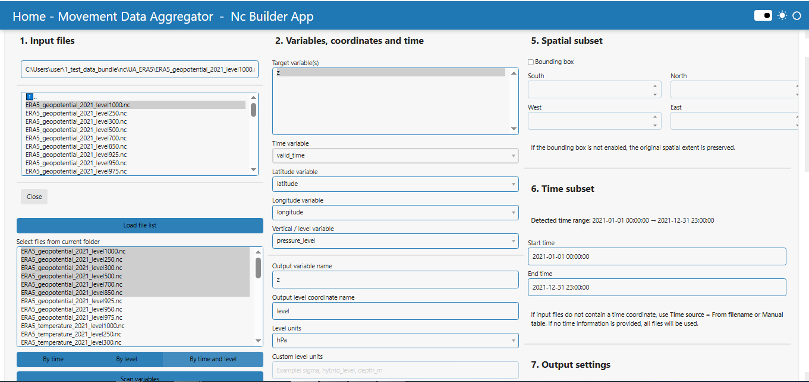
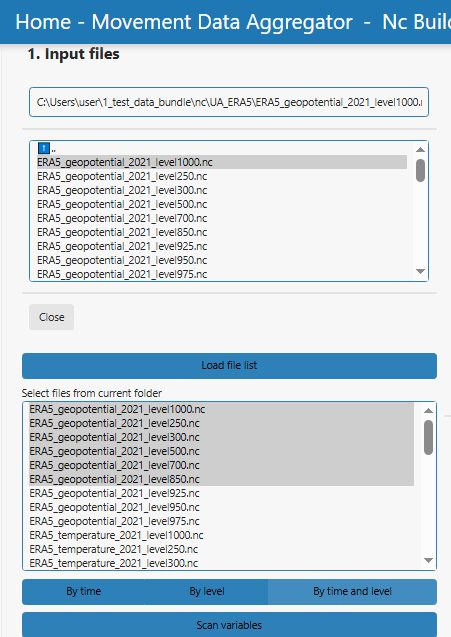
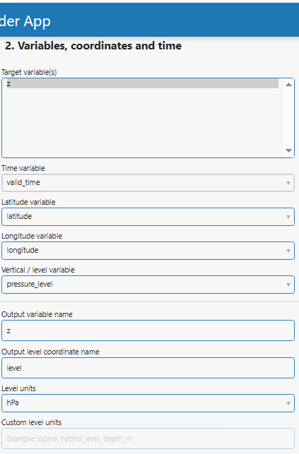
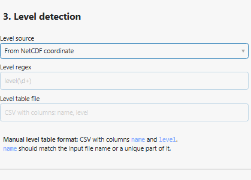
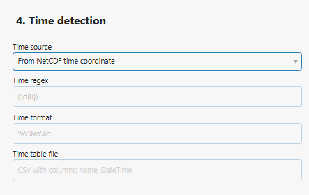
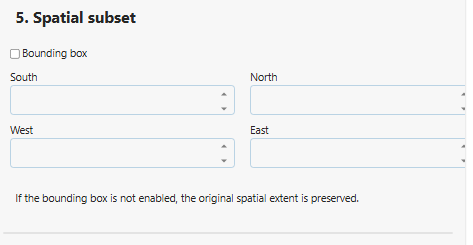
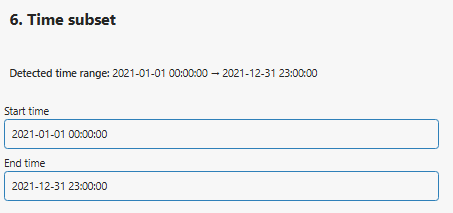
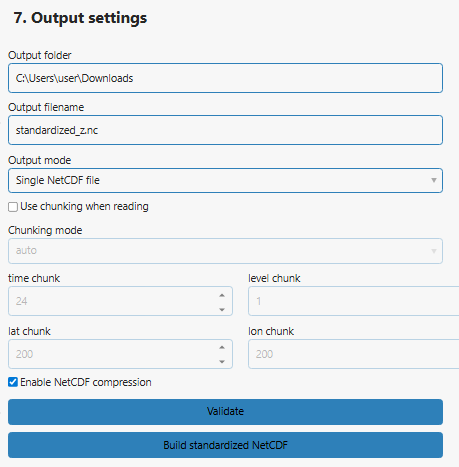
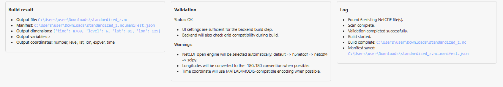

# NC Builder

## Overview

### App features

With the NC Builder App, you can

- Prepare and standardize NetCDF files for use in ECODATA annotation workflows.
- Load one or more NetCDF files from local folders.
- Inspect available variables, coordinates, dimensions, and time information.
- Select target variables and assign standard coordinate roles such as time, latitude, longitude, and vertical level.
- Combine files by time, by level, or by both time and level, depending on the structure of the source data.
- Optionally apply spatial and temporal subsetting.
- Export a standardized NetCDF file that can be used by ECODATA annotation apps.

### Using the app

1. If you haven't already, prepare the NetCDF files that need to be combined or standardized.
2. Launch the NC Builder App.
3. Select the input folder or input files containing the NetCDF data.
4. Choose the combine mode, such as combining by time, by vertical level, or by both time and level.
5. Inspect the detected variables and coordinates.
6. Select the target variable and assign the correct coordinate fields for time, latitude, longitude, and, if needed, vertical level.
7. If needed, set spatial or temporal subset options.
8. Specify the output file name and location.
9. Click the build button to create the standardized NetCDF file.
10. Review the status messages and check the output file before using it in annotation workflows.

## NetCDF Builder App User Manual

This manual describes the current workflow and interface of the NC Builder App in Ecodata Prepare!. The app prepares standardized CF-style NetCDF files from multiple ERA5 or other NetCDF inputs before further processing, including multilevel annotation which can be made in Multidimensional Annotation App.

## Purpose

The NetCDF Builder App is designed to combine, standardize, and optionally subset multiple NetCDF files into a single output file with predictable coordinate names and basic CF-style metadata.

The app is useful when environmental datasets are stored as separate files by time, by vertical level, or by both time and level. It can be used as a preparation step before annotation, 3D annotation, visualization, or other ECODATA workflows that expect harmonized NetCDF coordinates.

The module supports:

- Selecting a local folder and loading supported NetCDF files from that folder.
- Choosing which files from the folder should be included in scan, validation, and build steps.
- Combining files by time, by vertical level, or by both time and vertical level.
- Selecting one or more target variables for the output NetCDF file.
- Mapping source coordinate names to standard output names: time, lat, lon, and level.
- Detecting time and level information from NetCDF coordinates, filenames, or manual tables.
- Optionally applying a geographic bounding box subset.
- Optionally applying a time subset in modes where this is supported.
- Writing a single standardized NetCDF file and an accompanying manifest JSON file.

## Overview

### Step 1. Select Input Files

Use the section "1. Input files" to define the source folder and select the files that should be processed.

1. Input folder

   Select the folder that contains the NetCDF files using the file selector labelled "Input folder". The selector is used to define the folder. If a file inside the folder is selected, the app uses its parent folder.

2. Load file list

   Press "Load file list" to scan the selected folder for supported NetCDF-like files. Supported extensions are `.nc`, `.nc4`, `.cdf`, and `.netcdf`.

3. Select files from current folder

   After loading the file list, the widget "Select files from current folder" is populated with all supported files found in the folder. All files are selected by default. Deselect files that should not be included in the current build.

4. Combine mode

   Choose how the selected files should be combined:

   - By time: files are combined along the time dimension. In this mode, the selected files define the time range, and the Start time / End time widgets are disabled.
   - By level: files are combined along the vertical level dimension.
   - By time and level: files are combined using both time and level coordinates when possible.

5. Scan variables

   Press "Scan variables" after selecting the input files. The app scans selected files, detects available variables, coordinates, dimensions, and suggested coordinate names, and updates the Preview panel.

### Step 2. Configure Variables and Coordinates & time

Use this section to define which variable or variables will be written to the output file and how source coordinate names should be standardized.

Target variable(s)

Select one or more variables from the scanned source files. In single-variable case, the selected variable can be renamed using "Output variable name". In multi-variable mode, the app preserves the original variable names.

Coordinate mapping

- Time variable.
- Latitude variable.
- Longitude variable.
- Vertical / level variable: source variable or coordinate that represents vertical level. Use "None" if a level coordinate is not required.

Output coordinate names

The standardized output coordinate names are `time`, `lat`, `lon`, and `level`. The app writes basic CF-style coordinate attributes. For latitude and longitude, it uses `degrees_north` and `degrees_east`. For pressure levels, it can write `air_pressure` metadata.

Output variable name

In single-variable mode, this field defines the name of the data variable in the output NetCDF file. If the field is empty after scanning, the app usually fills it with the selected source variable name.

Output level coordinate name and Level units

The field "Output level coordinate name" is shown as a user setting, with the default value `level`. The current version standardizes the actual level coordinate to `level`. Use "Level units" to define whether the vertical coordinate is `hPa`, `m`, `Pa`, `model_level`, or `custom`. If `custom` is selected, enter the units in "Custom level units".

### Step 3. Configure Level Detection

Use "Level source" to define how vertical level values should be obtained.

- From NetCDF coordinate: use the selected "Vertical / level variable" from the input files.
- From filename: extract the level value from each filename using "Level regex". The default pattern is `level(\d+)`.
- Manual table: in "Level table file" paste path to the CSV table to read level values. The CSV should contain columns named `name` and `level`. The `name` value should match the input file name or a unique part of it.

### Step 4. Configure Time Detection

Use "Time source" to define how time values should be obtained.

- From NetCDF time coordinate: use the selected "Time variable" from the source files.
- From filename: extract the date or date-time value from each filename using "Time regex" and parse it using "Time format". The default pattern is `(\d{8})` and the default format is `%Y%m%d`.
- Manual table: read time values from a CSV table specified in "Time table file". In this case the CSV should contain columns named `name` and `DateTime` (example: `2026-01-01 00:00:00`).

### Step 5. Configure Spatial Subset

Use "Bounding box" if the output file should be cropped spatially. If the checkbox is not enabled, the original spatial extent is preserved.

When Bounding box is enabled, enter:

- South: minimum latitude.
- North: maximum latitude.
- West: minimum longitude.
- East: maximum longitude.

The app expects latitude and longitude coordinates that can be subset as one-dimensional lat/lon coordinates. If the requested bounding box does not overlap the file grid, the build step stops with an error.

### Step 6. Configure Time Subset

After scanning, the app displays "Detected time range" if time can be read from the scanned files. The fields "Start time" and "End time" define an optional time subset.

In "By time" mode, time subsetting is disabled. In that case, select the required files in "Select files from current folder" instead. This avoids unsafe time slicing for files that use non-standard calendars such as Julian or 360_day calendars.

In "By level" and "By time and level" modes, the app applies the time subset when a standard pandas-compatible time coordinate is available. For cftime calendars, the current implementation skips time slicing.

### Step 7. Define Output Settings and Build

Use "7. Output settings" to define how the output file is written.

- Output folder: folder where the generated NetCDF and manifest JSON files will be saved. The default is the Windows user Downloads folder.
- Output filename: name of the output NetCDF file. The default initial value is `era5_standardized_temperature.nc`. After scanning, the app may change it to `standardized_<variable>.nc` or `standardized_multivariable.nc`.
- Output mode: currently fixed to Single NetCDF file.
- Use chunking when reading: enables chunked reading through xarray/dask where available.
- Chunking mode: auto or manual. Manual mode enables time chunk, level chunk, lat chunk, and lon chunk fields.
- Enable NetCDF compression: writes compressed data variables using zlib compression when supported by the selected NetCDF writer.

Validation and build actions

- Validate: checks whether the selected settings are sufficient for the build step. It reports missing variables, invalid bounding-box values, missing time or level definitions, and output filename warnings.
- Build standardized NetCDF: starts the build process, writes the output NetCDF file, writes the manifest JSON file, and updates the Preview and Log panels.

### Step 8. Read Preview, Validation, and Log Panels

The lower part of the app contains three status panels.

- Preview: shows loaded files, scan results, detected variables, coordinates, dimensions, selected target variables, selected coordinate mappings, build results, and output paths.
- Validation: shows whether the current configuration is ready for building or lists issues that must be fixed.
- Log: records user actions and backend messages, including scan status, validation status, build start, build completion, and build errors.

## Output Files

The app creates one standardized NetCDF file and one manifest JSON file. The manifest file is saved next to the NetCDF file and uses the suffix `.manifest.json`.

### Standardized NetCDF File

The output NetCDF file contains:

- Selected target data variable or variables.
- Standardized coordinate names: `time`, `lat`, `lon`, and optionally `level`.
- CF-style coordinate attributes.
- Global attributes such as `title`, `Conventions`, `history`, `source_files_count`, and `combine_mode`.
- Longitude values converted to the -180..180 convention when possible.
- Optional MATLAB/MODIS-compatible time encoding: days since 2000-01-01 with julian calendar, when time is present.

### Manifest JSON File

The manifest records:

- `output_path` and `manifest_path`
- `processed_files`
- `engine_by_file`
- full build configuration
- validation warnings
- output dimensions
- output variables
- output coordinates
- time encoding information, when time is present

## Output Scenarios

Scenario 1. Combine mode = By time

Use this when separate files represent different times for the same variable and grid. The selected files define the time range. Start time and End time are disabled in this mode.

Scenario 2. Combine mode = By level

Use this when separate files represent different vertical levels for the same time or time range. Level values can be read from a NetCDF coordinate, extracted from filenames, or supplied by a manual table.

Scenario 3. Combine mode = By time and level

Use this when the source collection needs to be organized across both time and vertical levels. The app first standardizes each selected file and then combines datasets by coordinates when possible.

Scenario 4. Single target variable selected

The output variable can be renamed using "Output variable name". This is useful when source variable names are short or inconsistent.

Scenario 5. Multiple target variables selected

The output file keeps the original source variable names.

Scenario 6. Bounding box enabled

The output file is cropped to the selected South, North, West, and East limits for reducing file size.

Scenario 7. Bounding box disabled

The output file preserves the original spatial extent of the input files.

## Expected Results

After processing, you will obtain:

1. A standardized NetCDF file in the selected output folder.
2. A manifest JSON file next to the NetCDF file.
3. A Preview panel summary with output path, manifest path, output dimensions, output variables, and output coordinates.
4. A Log panel entry confirming that the build is complete.

## Processing Logic

When "Build standardized NetCDF" is pressed, the backend performs the following operations:

1. Validates that the selected files exist and that the required variables and coordinates are defined.
2. Loads manual time or level tables when Manual table mode is selected.
3. Opens each selected NetCDF file.
4. Selects the target variable or variables.
5. Renames source latitude and longitude coordinates to `lat` and `lon`.
6. Renames the selected time coordinate to `time` when time is read from NetCDF coordinates.
7. Renames the selected level coordinate to `level` when level is read from NetCDF coordinates.
8. Adds time or level dimensions from filenames or manual tables when needed.
9. Converts 0..360 longitudes to the -180..180 convention when possible.
10. Sorts common coordinates such as `time`, `level`, `lat`, and `lon`.
11. Applies the bounding-box subset when enabled.
12. Applies the time subset in supported combine modes and calendar cases.
13. Checks grid compatibility between datasets.
14. Combines datasets by coordinates or by the selected combine dimension.
15. Applies basic CF-style metadata.
16. Writes the standardized NetCDF file.
17. Writes the manifest JSON file.

## Notes and Limitations

- Input files must be readable by xarray using one of the supported NetCDF engines.
- The selected files should have compatible latitude and longitude grids. If grids differ, the build step can fail with a grid compatibility error.
- Bounding-box subsetting currently expects one-dimensional latitude and longitude coordinates.
- In "By time" mode, Start time and End time are disabled. Select the required files manually instead.
- For cftime calendars, preview can show the time range as strings, but time slicing may be skipped during build.
- The app writes the actual standardized level coordinate as `level`. The displayed "Output level coordinate name" setting is currently not used to rename the backend coordinate away from `level`.
- Manual time tables must contain `name` and `DateTime` columns. Manual level tables must contain `name` and `level` columns.
- When multiple target variables are selected, source variable names are preserved.
- The manifest is intended for reproducibility and troubleshooting. It should be kept together with the generated NetCDF file.
- The output file is standardized for usage in ECODATA apps but should still be checked scientifically before use in final analyses.
