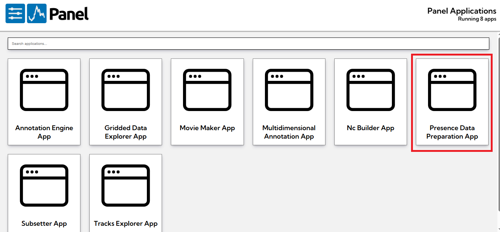
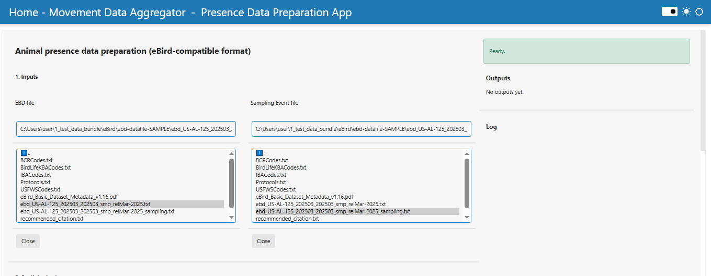
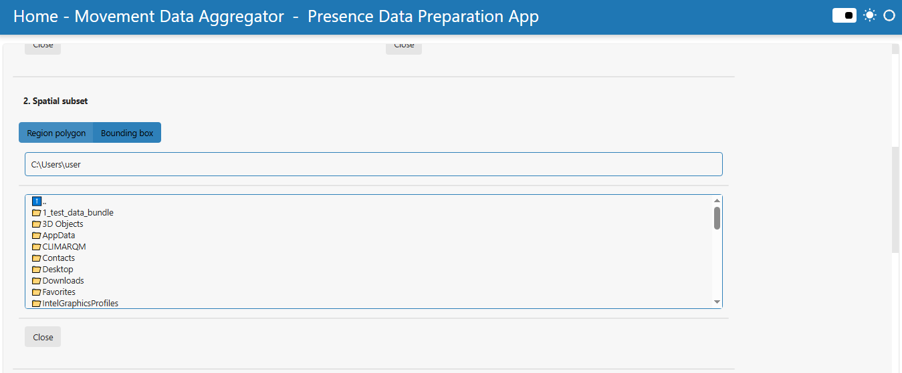
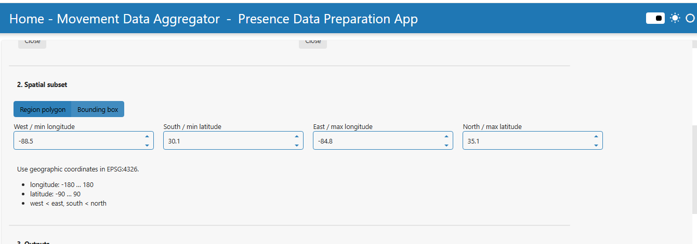
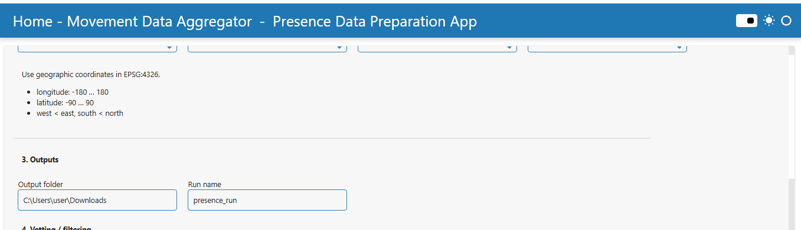
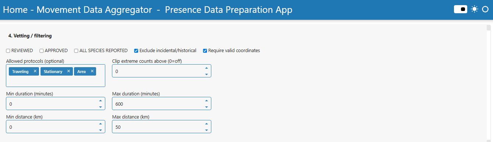
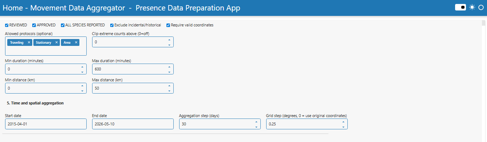
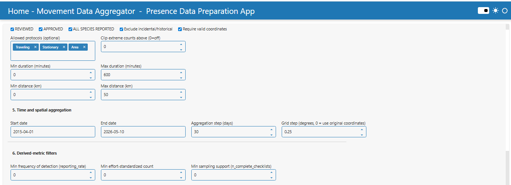
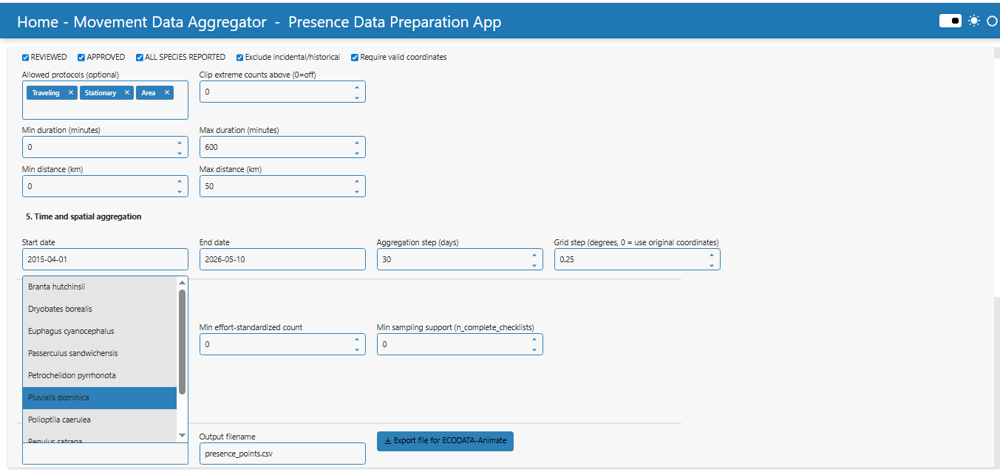

# Presence Data Preparation

## Overview

### App features

With the Presence Data Preparation App, you can

- Prepare species occurrence or presence-type observation data for further visualization and analysis in ECODATA.
- Load observation data and, when available, associated sampling or effort data.
- Filter records by selected temporal, spatial, taxonomic, and data-quality criteria.
- Aggregate observations by user-defined time intervals.
- Optionally aggregate observations to a regular spatial grid.
- Calculate basic presence and observation-effort metrics.
- Export prepared tables and tracks-style files for further use in ECODATA visualization workflows.

### Using the app

1. If you haven't already, prepare local copies of the observation data and, if needed, the associated sampling or effort file.
2. Launch the Presence Data Preparation App.
3. Under the input file options, select the observation data file. If the workflow requires sampling or effort information, also select the corresponding sampling file.
4. Select the required filtering options, such as date range, species, review status, and spatial limits.
5. If needed, enable spatial grid aggregation and set the grid step.
6. Select the time aggregation interval. The app groups observations into fixed time windows based on the selected number of days.
7. Click the processing button to run the aggregation.
8. Review the status messages and generated output information.
9. Save the output files. The app can create aggregated count data, aggregated presence data, presence points, and tracks-style files for further ECODATA visualization.

## Presence Data Preparation App User Manual

This manual describes the current workflow and interface labels of the Presence Data Preparation App in Ecodata Prepare!. The app prepares animal presence or observation datasets with an eBird-compatible column structure for analysis and visualization in ECODATA-Animate.

## Purpose

The Presence Data Preparation App is designed to prepare animal presence or observation datasets for further visualization and analysis in ECODATA-Animate.

The app is intended for tabular datasets that follow an eBird-compatible column structure. The input data do not necessarily have to come directly from eBird, but they must contain the required fields used by the app, such as observation coordinates, observation date, species name, observation count, and sampling event identifier.

The module supports:

- Selecting large local observation and sampling-event files.
- Combining observation records with sampling-event metadata.
- Filtering observations by spatial region, time range, protocol type, checklist quality, effort, and coordinate validity.
- Aggregating observations by fixed time intervals.
- Optionally aggregating observations to a regular geographic grid.
- Calculating count, presence, sampling-support, and effort-standardized metrics.
- Exporting a presence points file for ECODATA-Animate.

## Overview

### Step 1. Select Input Data

#### Observation Data: EBD file

Select the main observation table using the file selector labelled "EBD local path".

The file should contain animal observation records in an eBird-compatible structure.

Required columns include:

- sampling event identifier
- latitude
- longitude
- observation date
- scientific name
- common name
- observation count

Optional but useful columns include:

- time observations started
- observation type
- protocol code
- reviewed
- approved

#### Sampling Event Data

Select the sampling-event table using the file selector labelled "Sampling local path".

Required column:

- sampling event identifier

Useful optional columns include:

- all species reported
- protocol type
- protocol name
- duration minutes
- effort distance km
- number observers

The app joins the observation table and sampling-event table using SAMPLING EVENT IDENTIFIER.

### Step 2. Configure Spatial Subset

Choose the spatial filtering mode in the "Spatial filter" control. Two modes are available: "Region polygon" and "Bounding box".

#### Region polygon

Select a polygon file using the file selector labelled "Region polygon local path (shapefile or GeoJSON)".

Supported inputs include GeoJSON/JSON files and zipped shapefiles. Only observations located inside the selected polygon are used.

#### Bounding box

Enter the following coordinates manually:

- West / min longitude
- South / min latitude
- East / max longitude
- North / max latitude

Coordinates must be in EPSG:4326 geographic coordinates. Longitude must be between -180 and 180, latitude must be between -90 and 90, west must be smaller than east, and south must be smaller than north.

### Step 3. Define Output Settings

Use "Output folder" to define where the generated files will be saved. By default, the app uses the Windows user Downloads folder, for example `C:\Users\<username>\Downloads`.

Use "Run name" to define the prefix for generated output files. The default run name is:

- `presence_run`

For this default run name, the app creates files such as:

- `presence_run__agg_counts.csv`
- `presence_run__agg_presence.csv`
- `presence_run__manifest.json`
- `presence_run__presence_points.csv`

### Step 4. Configure Vetting / Filtering

The app provides several optional filters to remove unsuitable or low-quality records before aggregation.

Checklist and review filters

- REVIEWED: if enabled, only records marked as reviewed are kept when this column is available.
- APPROVED: if enabled, only records marked as approved are kept when this column is available.
- ALL SPECIES REPORTED: if enabled, only complete checklists are kept when this column is available.
- Exclude incidental/historical: if enabled, incidental and historical protocols are removed when protocol information is available.
- Require valid coordinates: removes records with missing or invalid latitude/longitude values.

Protocol and count filters

- Allowed protocols (optional): selects which protocol types should be included. Typical options are Traveling, Stationary, Area, Incidental, and Historical.
- Clip extreme counts above (0=off): optionally limits unusually high observation counts. A value of 0 disables clipping.

Effort filters

- Min duration (minutes) and Max duration (minutes): filter records based on DURATION MINUTES when available.
- Min distance (km) and Max distance (km): filter records based on EFFORT DISTANCE KM when available.

### Step 5. Configure Time and Spatial Aggregation

- Start date: first date included in processing.
- End date: last date included in processing.
- Aggregation step (days): size of the temporal aggregation window in days.
- Grid step (degrees, 0 = use original coordinates): spatial aggregation setting.

Examples of aggregation step values:

- 1 = daily aggregation.
- 7 = fixed 7-day aggregation.
- 30 = fixed 30-day aggregation.

If Grid step is 0, the app keeps original observation coordinates. If Grid step is greater than 0, observations are assigned to regular longitude/latitude grid nodes and aggregated by grid node.

### Step 6. Configure Derived-Metric Filters

After the main aggregation is completed, the app can filter the aggregated counts file using derived metrics.

- Min frequency of detection (reporting_rate): keeps only records where the detection frequency is above the selected threshold.
- Min effort-standardized count: keeps only records where `count_per_complete_checklist` is above the selected threshold.
- Min sampling support (`n_complete_checklists`): keeps only records with enough complete checklists.

These filters are applied after aggregation and before the species list is updated.

### Step 7. Run Actions

#### Aggregate

Press "Aggregate" to start processing.

The app performs the following steps:

1. Reads the observation and sampling-event tables from local file paths.
2. Checks that required columns are present.
3. Merges observation records with sampling-event metadata using SAMPLING EVENT IDENTIFIER.
4. Parses timestamps from observation date and optional observation time.
5. Converts latitude and longitude to numeric coordinates.
6. Applies vetting and effort filters.
7. Applies spatial filtering using a polygon or bounding box.
8. Applies time filtering.
9. Assigns observations to fixed time bins.
10. Optionally assigns observations to regular grid nodes.
11. Groups observations by time bin, location, and species.
12. Calculates count, presence, sampling-support, and effort-standardised metrics.
13. Saves aggregated output files and a manifest file.

#### Export file for ECODATA-Animate

After aggregation, optionally select one or more species in "Species in results". If no species are selected, all species in the aggregated counts file are exported.

The "Output filename" field is displayed in the interface with the default value `presence_points.csv`. In the current implementation, the actual generated file path is based on the run name and is saved as:

- `<run_name>__presence_points.csv`

Press "Export file for ECODATA-Animate" to convert the aggregated counts table into a file that can be used in Ecodata Animate (the version with "Presence visualization options" tab).

## Output Files

The app creates three main CSV outputs and one manifest JSON file. With the default run name `presence_run`, the files are named `presence_run__agg_counts.csv`, `presence_run__agg_presence.csv`, `presence_run__manifest.json`, and `presence_run__presence_points.csv`.

| Output file | Created when | Main purpose |
| --- | --- | --- |
| agg_counts CSV | After pressing "Aggregate" | Quantitative aggregation by time bin, location, and species. |
| agg_presence CSV | After pressing "Aggregate" | Presence aggregation by time bin, location, and species. |
| manifest JSON | After pressing "Aggregate" | Processing metadata and selected settings. |
| presence_points CSV | After pressing "Export file for ECODATA-Animate" | Animate-ready point file generated from agg_counts. |

### Aggregated Counts File

Default name: `presence_run__agg_counts.csv`

It contains aggregated count and effort-standardized metrics for each species, time bin, and spatial unit.

Typical columns include:

- `time_bin_start`, `time_bin_end`
- `location-lat`, `location-long`
- `species`
- `total_count`
- `n_checklists`, `n_checklists_all`, `n_complete_checklists`
- `n_detected_complete_checklists`
- `sum_duration_hours_complete`, `sum_party_hours_complete`
- `reporting_rate`
- `count_per_complete_checklist`
- `count_per_hour`
- `count_per_party_hour_complete`
- `mean_count_when_detected`
- `region_id`

### Aggregated Presence File

Default name: `presence_run__agg_presence.csv`

It indicates whether a species was detected in a given time bin and spatial unit.

Typical columns include:

- `time_bin_start`, `time_bin_end`
- `location-lat`, `location-long`
- `species`
- `presence`
- `n_checklists`, `n_checklists_all`, `n_complete_checklists`
- `n_detected_complete_checklists`
- `reporting_rate`
- `region_id`

Note: Rows are created where a species was detected. The file does not automatically generate absence rows with presence = 0 for all possible species-location-time combinations.

### Presence Points File for ECODATA-Animate

Default name: `presence_run__presence_points.csv`

This file is generated from the aggregated counts file. It reformats the aggregated output into a structure that can be used by ECODATA-Animate.

Typical columns include:

- `timestamp`
- `location-long`, `location-lat`
- `individual-local-identifier`
- `species`
- `count`
- `bin_id`
- `region_id`
- `total_count`
- `n_checklists`, `n_checklists_all`, `n_complete_checklists`
- `n_detected_complete_checklists`
- `sum_duration_hours_complete`, `sum_party_hours_complete`
- `reporting_rate`
- `count_per_complete_checklist`
- `count_per_hour`
- `count_per_party_hour_complete`
- `mean_count_when_detected`

## Output Scenarios

Scenario 1. Region polygon selected

- Observations are filtered to the selected polygon.
- `region_id` is generated from the polygon filename.
- Output files represent only the selected region.

Scenario 2. Bounding box selected

- Observations are filtered to the selected rectangular extent.
- `region_id` is generated from the bounding-box coordinates.
- Output files represent the selected coordinate range.

Scenario 3. Grid step = 0

- Original observation coordinates are preserved.
- Aggregation is performed by original location.
- This is useful when exact observation coordinates should be retained.

Scenario 4. Grid step > 0

- Observations are assigned to regular grid nodes.
- Aggregation is performed by time bin, grid node, and species.
- This is useful for reducing spatial noise and preparing smoother maps.

Scenario 5. Derived-metric filters enabled

- Aggregated records are filtered after calculation.
- Low values of `reporting_rate`, effort-standardized count, `n_complete_checklists` records can be removed.

## Expected Results

After successful processing, you will obtain:

1. An aggregated counts file ending with `__agg_counts.csv`.
2. An aggregated presence file ending with `__agg_presence.csv`.
3. A manifest file ending with `__manifest.json`.
4. Optionally, a ready to be animated presence points file ending with `__presence_points.csv`.

The outputs can be used for visualising temporal changes in ECODATA-Animate (version with "presence visualization options tab").

## Formulas of Output Metrics

The metrics are calculated for each aggregation group: species + time bin + location.

The location can be either the original observation coordinates or a grid node if grid aggregation is enabled.

a) `total_count` - Sum of all parsed OBSERVATION COUNT values for a given species, time bin, and location. If OBSERVATION COUNT = X, it is treated as 1.

`total_count = sum of observation counts`

b) `n_checklists` - Counts unique SAMPLING EVENT IDENTIFIER values where the species was present.

`n_checklists = number of unique checklists where the species was detected`

c) `n_checklists_all` - Counts all unique checklists in the same time bin and location, after filtering, regardless of species.

`n_checklists_all = total number of unique checklists in the time-space unit`

d) `n_complete_checklists` - Counts checklists where ALL SPECIES REPORTED is interpreted as true.

`n_complete_checklists = number of complete checklists`

e) `n_detected_complete_checklists` - Counts complete checklists in which the species was recorded.

`n_detected_complete_checklists = number of complete checklists where the species was detected`

f) `sum_duration_hours_complete` - total duration of complete checklists, in hours. Uses only complete checklists.

`duration_hours = duration minutes / 60`

`sum_duration_hours_complete = sum(duration_hours for complete checklists)`

g) `sum_party_hours_complete` - total observer-effort time for complete checklists.

`party_hours = duration_hours * number observers`

`sum_party_hours_complete = sum(party_hours for complete checklists)`

h) `reporting_rate` - frequency of detection, shows how often the species was detected in complete checklists.

`reporting_rate = n_detected_complete_checklists / n_complete_checklists`

i) `count_per_complete_checklist` - effort-standardised count per complete checklist, shows the average count relative to the number of complete checklists.

`count_per_complete_checklist = total_count / n_complete_checklists`

j) `count_per_hour` - count standardised by checklist duration, shows the number of observed individuals per hour of complete-checklist effort.

`count_per_hour = total_count / sum_duration_hours_complete`

k) `count_per_party_hour_complete` - count standardised by observer effort, accounts for both observation duration and number of observers.

`count_per_party_hour_complete = total_count / sum_party_hours_complete`

l) `mean_count_when_detected` - mean count per checklist where the species was detected, shows the average count only among checklists where the species was recorded.

`mean_count_when_detected = total_count / n_checklists`

## Notes and Limitations

- Input tables must follow an eBird-compatible column structure.
- Data do not have to come directly from eBird, but required columns must be present.
- The app currently creates presence-only rows for detected species. It does not generate a complete absence matrix.
- If no observations remain after filtering by date, region, protocol, or effort, the output may be empty.
- If coordinates cannot be parsed as numeric values, those records are removed when "Require valid coordinates" is enabled.
- If ALL SPECIES REPORTED is missing or not marked as true, complete-checklist-based metrics may be zero or unavailable.
- `reporting_rate` depends on the availability and quality of complete checklist information.
- `count_per_hour` and `count_per_party_hour_complete` depend on duration and observer-count fields.
- The presence points file is designed for visualization and should not be treated as raw observation data.
