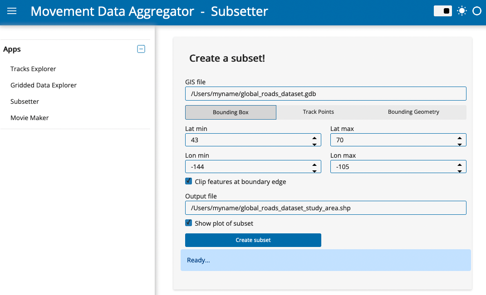

# Subsetter

## App features

With the Subsetter App, you can 
- Clip relevant features out of large shapefiles based on a bounding box, the extent of a tracking dataset, or a custom polygon.
- Save the extracted subset for further use.

## Using the app

1. In the “GIS file” field, paste the full filepath to a GIS dataset (e.g., a shapefile or file geodatabase) from which you want to extract a subset. The filepath should include the file name, or if the dataset consists of multiple files (e.g., for a shapefile) the folder in which the files are saved. An example filepath is "/Users/myname/global_roads_dataset.gdb".
2. Next, define the spatial area for which you want to extract data from the GIS dataset. You can do this using a bounding box, track points, or a bounding geometry. There are specific settings for each option:

    * **Bounding Box:** Specify the latitude and longitude range for a rectangular bounding box. Provide coordinates in decimal degrees, WGS84 coordinate reference system.

    * **Track Points:** Provide the full filepath, including the filename, for a .csv file of tracking data containing [location-long](http://vocab.nerc.ac.uk/collection/MVB/current/MVB000146/) and [location-lat](http://vocab.nerc.ac.uk/collection/MVB/current/MVB000145/) in decimal degrees, WGS84 coordinate reference system. The app will draw a boundary around the track data: choose whether to do this using a rectangular or convex hull method, and optionally define a buffer around which to expand the boundary. This buffer is relative to the extent of the tracking data (the selected buffer size times the greater of the north-south or east-west extent).

    * **Bounding Geometry:** Provide the full filepath, including the filename, for a file (.geojson, .shp or .gdb) defining a polygon. This could include output of the [Tracks Explorer App](tracks_explorer).

3. For any of the options above, decide whether to clip features that overlap with the edge of the spatial area defined in the previous step. Uncheck "Clip features at boundary edge" to retain complete lines or polygons that overlap with the boundary edge.
By default, the app will plot the data subset once it is created, along with the geometry that was used to create the subsetting boundary, and the actual geometry that was used to define the subset. If you don’t want to plot the dataset, uncheck “Show plot of subset”.
4. Change the name of the output file and specify a filepath if you wish. Then click "Create subset". A shapefile will be saved for the subsetted dataset, and a plot will appear unless you turned the plotting option off.