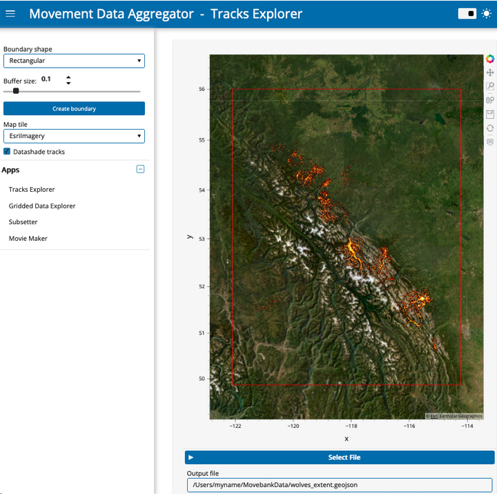
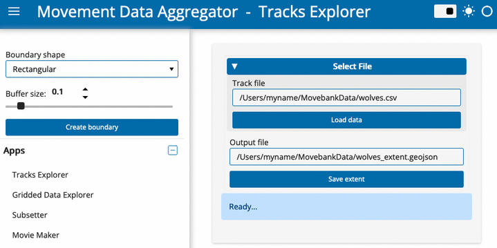
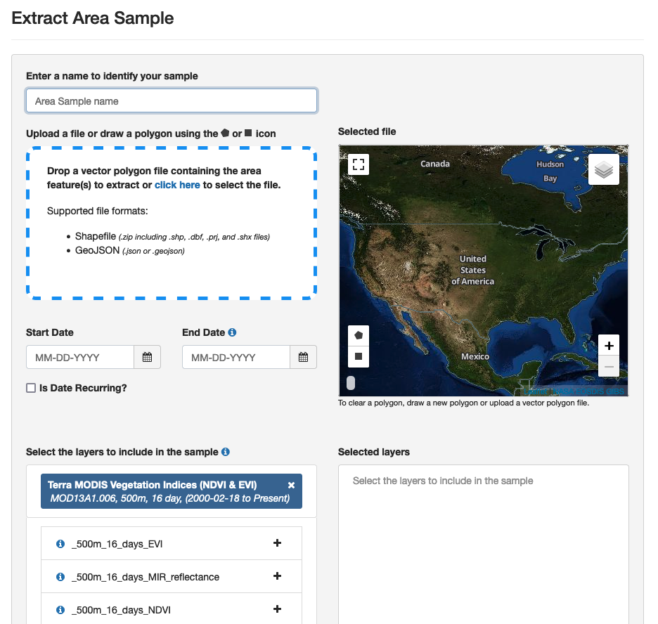
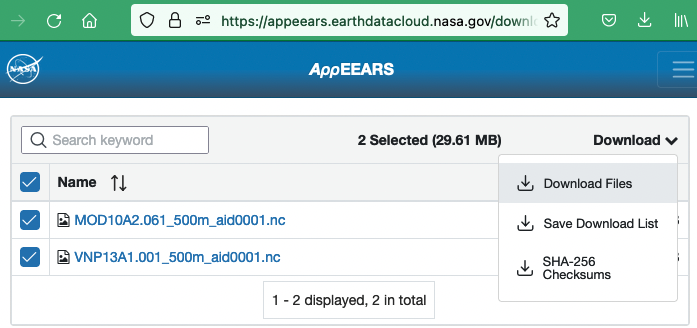

# Tracks Explorer

## App features

With the Tracks Explorer App, you can
- Visualize point locations from your Movebank data as individual points or aggregated point density. You can select from a variety of map tiles to use as a background.
- Automatically generate a spatial frame around the track points and save this as a .geojson file that can be used in the NASA AppEEARS interface to extract remote sensing products for the research area.

## Using the app

*Data from Hebblewhite and Merrill, study [Hebblewhite Alberta-BC Wolves](https://www.movebank.org/cms/webapp?gwt_fragment=page=studies,path=study209824313)*

1. If you haven't already, download a local copy of the tracking data you want to use, in Movebank's .csv format. It is possible to subset or combine data from different studies.
2. [Launch the Tracks Explorer App.](index)
3. Under "Select File", paste the full filepath to a .csv file of tracking data, including the file name. In the current version, this .csv file needs to use Movebank's format. An example filepath is "/Users/myname/MovebankData/wolves.csv".
4. Click "Load data". An interactive map will appear of your dataset, where you can pan/zoom to explore the dataset. If a map does not load, view the status message. The message "Error.. Check options and try again" likely indicates that your filepath is incorrect.
5. You can change the background map tile using the drop-down menu in the sidebar.
6. Toggle the "Datashade tracks" checkbox in the sidebar to turn on/off the point density aggregation feature. When unchecked, individual semi-transparent points will be displayed. Note that for very large datasets, plotting will be slow if the "Datashade tracks" option is turned off.
7. A boundary for the tracks dataset is shown on the map in red. The default option uses a rectangular boundary with a buffer size of 0.1 (scale relative to the extent of the tracks). You can adjust the buffer size or change the boundary shape to a convex hull using the widgets in the sidebar.
8. To save the boundary to a .geojson file, scroll down and if needed, edit the file name and location under "Output file". Then simply click the "Save extent" button.

(request-nasa-data)=
## Requesting environmental data from NASA

You can use a .geojson file from the Tracks Explorer app to submit a request for environmental data from NASA's Application for Extracting and Exploring Analysis Ready Samples (AρρEEARS) service. 
1. Go to NASA AppEEARS: <https://appeears.earthdatacloud.nasa.gov/> 
2. These data are free, but you will need an EarthData account to request data. Register at <https://urs.earthdata.nasa.gov/users/new>, and then sign in with your EarthData account. 
3. In the top menu bar, click "Extract > Area".
4. Click "Start new request". The interface looks like this:

5. In the Extract Area Sample page, first upload the .geojson file you created in the Tracks Explorer. Alternatively, you can draw a polygon on the page or upload another .geojson or .shp file. It will display a preview of the area for which data will be provided.
6. Select a date range. You can choose calendar dates for the start and end of the period, or select "Is Date Recurring?" to select a specific range of dates across years. 
7. Select the data layers you want. Type a product name (e.g., "MYD10A2") or description (e.g., "snow") and it will display a list summarizing relevant products. To review all options, available products are listed at https://appeears.earthdatacloud.nasa.gov/productsNASA data. Also see the searchable catalog of many of these products at https://lpdaac.usgs.gov/product_search/?status=Operational. Once you have selected a product(s) from the list, click the "+" button on each desired layer. The layers will appear in the "Selected Layers" box to the right.
8. In "Output options" at the bottom of the page, select "NetCDF-4" as the file format and "Geographic" as the projection.
9. Select "Submit". Your submission will be added to a queue and you will receive emails from appeears-noreply@nasa.gov confirming the submission and notifying you when the data are ready for download. The time needed to complete the request likely depends on the volume of data requested and the number of other requests their service has recently received. In our tests so far they have come through within a few hours.
10. When your data are ready for download, click the "Download" link in the email you received from appeears-noreply@nasa.gov.
11. The Appeears website will open in a new tab (log into your account if prompted) and you will see a list of files available to download. Supporting files are listed first, however you will need to download the resulting netcdf (.nc) file for the next step in the ECODATA-Prepare app (Gridded Data Explorer). 
12. Check the box to the left of the file name and select Download > Download Files at the right. The downloaded file will appear in your Downloads folder, which you can then move to a local folder. We also recommend downloading at least the README.md file under Supporting files. This will document details of your request and results that you may need to return to later, including data quality information and how to cite your results. 

