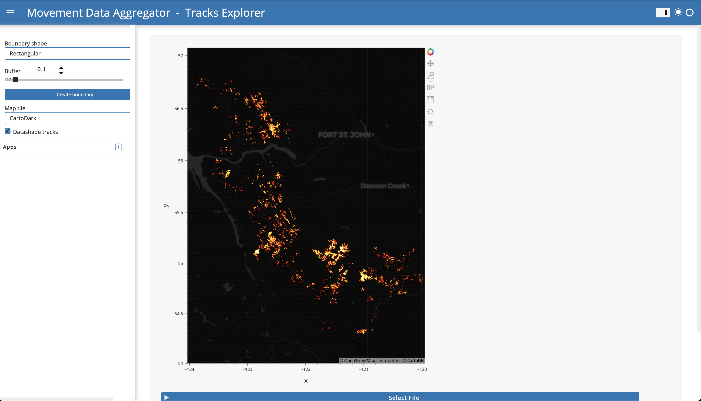

# Tracks explorer

## App features

- Visualize Movebank tracks data using either an aggregated point density map (good for visualizing patterns) or a
standard plot of all points. Can select from a variety of map tiles to use as a background.
- Automatically generate a spatial frame around the track points and prepare a .geojson file that can be used in the
NASA AppEEARS interface to extract remote sensing products for the research area.

## Using the app
1. Under "Select File", paste the full filepath to a .csv file of Movebank track data. In the current version, this .csv
file needs to use Movebank's format.
2. Click "Load data". An interactive map will appear of your dataset, where you can pan/zoom to explore the dataset.
3. You can change the background map tile using the drop-down menu in the sidebar.
4. You can turn on/off the point density aggregation feature by toggling the "Datashade tracks" checkbox in the sidebar.
Note that for very large datasets, plotting will be slow if the "Datashade tracks" option is turned off.
5. A boundary for the tracks dataset is shown on the map in a red outline. The default option uses a rectangular
boundary with a buffer size of 0.1 (relative scale to the tracks extent). You can adjust the buffer size or change the
boundary shape to a convex hull using the widgets in the sidebar.
6. To save the boundary to a .geojson file, simply click the "Save extent" button. If you want, you can edit the
location/file name before you save the file.

## Requesting environmental data from NASA AppEEARS

Once you have a .geojson file from the Tracks Explorer app, you can submit a request for NASA data.
- Go to [NASA AppEEARS](https://appeears.earthdatacloud.nasa.gov). You will need to make an account to request data.
- In the top menu bar, click "Extract > Area".
- Click "Start new request"
- In the new request page, you can upload the .geojson file, select a date range, and select the data layers you want.
- In "Output options" at the bottom of the page, select “NetCDF-4” as the file format and “Geographic” as the projection.